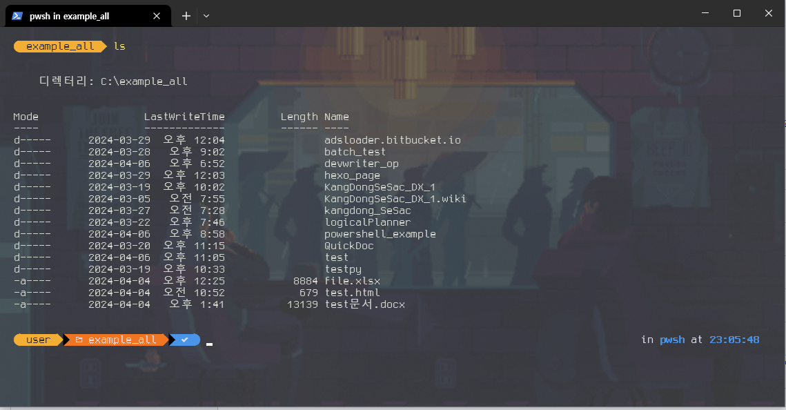
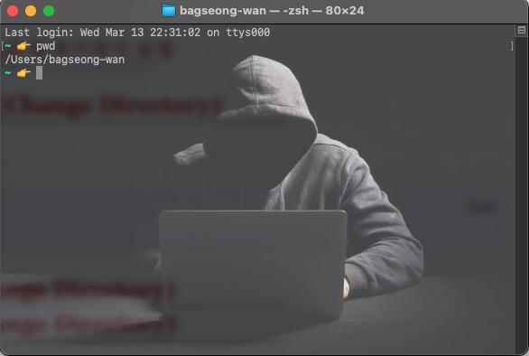
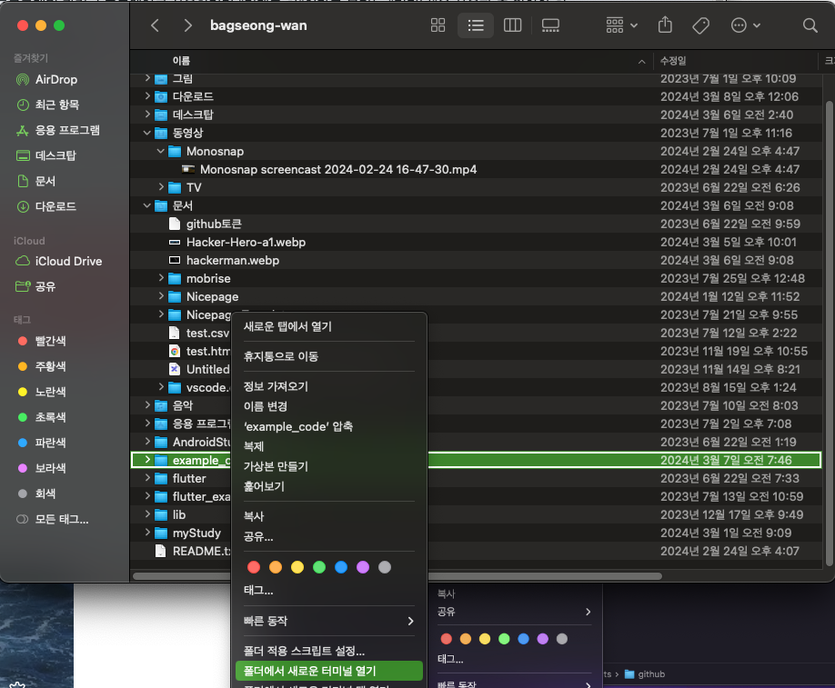
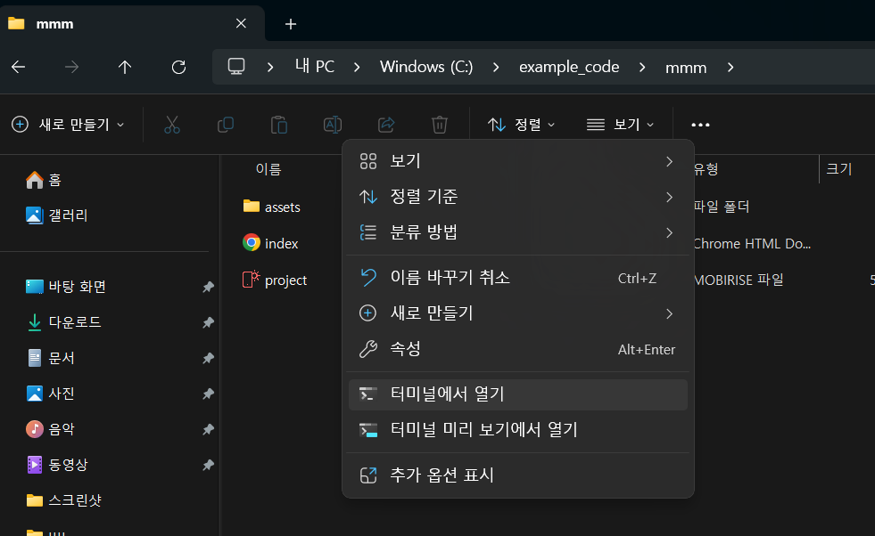
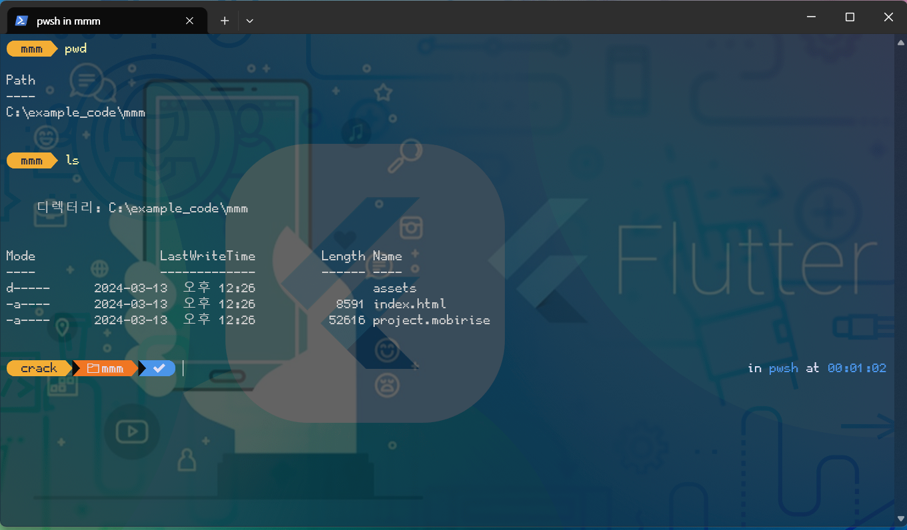
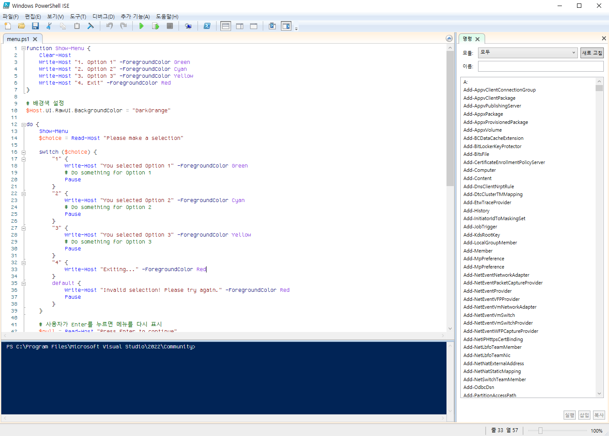

# Powershell 시작하기 



터미널 환경은 문자기반의 환경이다보니 처음 사용자들에게 직관적이지 못한 느낌을 주게 된다. 그러나 다양한 기능과 강력함을 습득하게 된다면 GUI 환경에 불편함을 느끼게 된다. 운영체제(OS)의 기반이 되는 `중요한 기능들이 Terminal 환경에서 제공`되기 때문이다. 

윈도우에서는 기본적으로 cmd와 같은 명령 프롬프트 환경을 제공한다. DOS때부터 제공되었던 기능이다. 그러나 [Store에서 터미널 설치를 강권](https://apps.microsoft.com/detail/9n0dx20hk701?activetab=pivot%3Aoverviewtab&hl=ko-kr&gl=KR)한다. Windows 10 이상부터는 Powershell을 기본 탑재하므로 Terminal과 Powershell의 조합으로 강력한 컴퓨팅 환경을 구축할 수 있다. 

## 1. 터미널의 중요성

왜? 편리한 그래픽 환경(GUI)을 두고 불편한 문자기반 명령어 환경(CUI)을 사용해야 한다는 것일까? 이유는 다음과 같다. 

| 중요성 및 장점         | 설명                                                                       |
| ---------------- | ------------------------------------------------------------------------ |
| 1. 자동화, 스크립팅 지원  | 자동화된 작업과 스크립트 작성이 용이하다.<br>여러 명령을 한 번에 프로그래밍 하듯 처리 할 수 있다.               |
| 2. 빠른 작업         | 그래픽 사용자 인터페이스(GUI)보다 <br>터미널을 통해 작업할 때 더 빠른 처리 속도를 제공한다.                 |
| 3. 강력한 명령어       | 강력한 명령어와 도구를 사용할 수 있다. <br>시스템 관리 및 문제 해결이 효율적으로 가능하다.                   |
| 4. 리소스 효율성       | GUI와 달리 터미널은 시스템 자원을 적게 사용한다.<br>더 많은 작업을 처리할 수 있다.                      |
| 5. 원격 관리         | 원격 서버 또는 컴퓨터에 터미널을 통해 접속할 수 있다.  <br>서버 관리 및 작업을 수행할 때 강력한 기능을 사용할 수 있다. |
| 6. 사용자 취향의 환경 설정 | 터미널 환경을 자신에게 맞게 설정하고 사용자 정의할 수 있어 효율적인 작업 환경을 구성할 수 있다.                  |

터미널은 "빠르고 강력한 자동화" 기능을 만들고자 할 때, 반드시 사용할 수 밖에 없는 환경이다. 그러므로 `강력한 업무 자동화에는 필수적으로 사용`할 수 밖에 없다.  

## 2. 파일, 디렉토리를 위한 필수 명령어


**터미널에 익숙치 못한 사람들(🤔)의 바탕화면을 보면 대체적으로 위의 그림과 같은 경우가 있다**. 

`문서자료를 카타고리`로 관리하지 않는다. 이런 이유는 "디렉토리(폴더)와 파일"에 대한 개념이 희박해서 생기는 현상이다(20세기에는 PC학습의 첫번째 순서가 DOS 명령어 또는 터미널 환경이었다). `디렉토리(폴더)별로 파일관리`한다면 터미널에서 파일을 생성하거나 경로를 이동하는 것에 대해 빠른 이해를 가지게 된다. 

터미널에서 가장 기본이 되는 명령어는 "파일과 디렉토리"에 관련된 명령어이다.

> 👋🙄👉 Powershell에서는 몇몇 bash와 DOS 명령어를 사용할 수 있다. 그러므로 Powershell 명령어 대신 DOS나 Bash 명령어를 사용하는 경우도 흔하다. 특히 경로이동에 관련된 명령어는 Bash 명령어를 더 많이 사용하게 된다.  타이핑을 적게 하는 것이 편하기 때문이다. 

| 동작              | DOS 명령어                             | Bash 명령어                  |
| --------------- | ----------------------------------- | ------------------------- |
| 현재 디렉토리 확인      | `cd` 또는 `chdir`                     | `pwd`                     |
| 디렉토리 변경         | `cd` 또는 `chdir` 경로명                 | `cd` 경로명                  |
| 디렉토리 목록 확인      | `dir`                               | `ls` 또는 `dir`             |
| 파일 생성           | `type nul > filename`               | `touch`                   |
| 파일 복사           | `copy source_file destination_file` | `cp`                      |
| 파일 이동           | `move source_file destination`      | `mv`                      |
| 파일 삭제           | `del filename`                      | `rm`                      |
| 파일 내용 확인        | `type filename`                     | `cat` 또는 `less/more`      |
| 파일 내용 출력 및 필터링  | `find "pattern" filename`           | `grep`                    |
| 파일 및 디렉토리 크기 확인 | `dir /s` 또는 `dir /s /a`             | `du` 또는 `ls -l`           |
| 파일 압축 및 해제      | N/A (DOS에 기본적인 압축/해제 도구 없음)         | `tar` 및 `gzip` 또는 `unzip` |

그리고 Powershell에서는 다음과 같이 사용하고 있다.

| 동작              | PowerShell 명령어                        | Bash 명령어                  |
| --------------- | ------------------------------------- | ------------------------- |
| 현재 디렉토리 확인      | `Get-Location`                        | `pwd`                     |
| 디렉토리 변경         | `Set-Location`                        | `cd`                      |
| 디렉토리 목록 확인      | `Get-ChildItem`                       | `ls` 또는 `dir`             |
| 파일 생성           | `New-Item`                            | `touch`                   |
| 파일 복사           | `Copy-Item`                           | `cp`                      |
| 파일 이동           | `Move-Item`                           | `mv`                      |
| 파일 삭제           | `Remove-Item`                         | `rm`                      |
| 파일 내용 확인        | `Get-Content`                         | `cat` 또는 `less/more`      |
| 파일 내용 출력 및 필터링  | `Select-String`                       | `grep`                    |
| 파일 및 디렉토리 크기 확인 | `Get-Item`                            | `du` 또는 `ls -l`           |
| 파일 압축 및 해제      | `Compress-Archive` 및 `Expand-Archive` | `tar` 및 `gzip` 또는 `unzip` |

#### ■ 실행 & 현재경로 
> 윈도우에서는 윈도우 키를 누르고 "터미널". macOS에서는 cmd + space를 누르고 "터미널"을 입력하면 실행가능하다. 그러나 특정 폴더(디렉토리)에서부터 빠르게 시작하고자 한다면 Finder나 탐색기의 메뉴를 통해 바로 실행할 수도 있다. 

현재 경로명을 표시하는 명령어는 다음과 같다. 
```bash
pwd 
```


#### ■ macOS의 Finder에서 실행



1. finder에서 폴더선택
2. 우클릭, 메뉴생성
3. 메뉴에서 `폴더에서 새로운 터미널 열기` 선택

#### ■ windows의 탐색기에서 실행




1. 탐색기에서 폴더선택
2. 우클릭, 메뉴생성
3. 메뉴에서 `터미널에서 열기` 선택

#### ■ 현재 경로의 파일과 폴더보기(ls)
> **ls** 명령어를 통해 현재 폴더의 하위폴더와 파일들을 볼 수 있다.


가장 빈번하게 사용되는 명령어이다. 

#### ■ 경로이동(Change Directory)

> **cd** 명령어를 사용한다. 절대경로를 이용하여 한 번에 이동도 가능하다. 그러나 대부분 현재 폴더를 기준으로 상대위치에 존재하는 폴더명으로 이동한다. 상위폴더로 이동시에는 ".."를 사용하여 이동한다.
> 

1. 상위폴더 이동
```bash
cd ..
```

2. 하위 폴더 이동
```bash
cd 하위폴더명
```

3. 절대폴더 이동
``` bash
cd 절대경로
```

#### ■ 삭제
> macOS: rm 파일명[폴더명]
> windows:
>   del 파일명 
>   rmdir 폴더명
> 을 통해서 파일이나 폴더를 삭제할 수 있다. 

만약 폴더에 내부파일이 있다면  다음과 같은 명령어를 수행하여 삭제가 가능하다. 

(macOS)
```bash
rm -rf 폴더명
```

(windows)
```bash
rmdir /s 폴더명
```

#### ■ 복사
> cp 원본파일명 타겟파일명 을 통해서 파일을 복사할 수 있다. 

다음은 현재 폴더의 a.txt를 하위 폴더 text에 들어가는 b.txt로 복사하는 예제이다. 
```bash
cp a.txt text/b.txt
```


## 3. 터미널의 자동완성 & 핫키
대부분의 터미널에서는 자동완성 기능을 제공하고 있다.


| tab    | 문자를 입력하고 tab을 누르면 <br>1. 현재 폴더의 있는 파일(폴더)명으로 완성(`공통사항`)<br>2. 가장 비슷한 커맨드를 찾아 완성(`PowerShell`)<br>의 기능으로 자동완성 기능을 제공한다. |
| ------ | ---------------------------------------------------------------------------------------------------------------------- |
| 우측 화살표 | Powershell 7.X 이상 또는 Powershellget 패키지 설치 시<br>우측 화살표로 자동완성 가능                                                         |

그리고 다음과 같은 hot-key를 자주 사용하게 된다. 

| 핫키                   | 기능                                                    |
| -------------------- | ----------------------------------------------------- |
| ctrl + z<br>ctrl + c | 지금 실행되는 프로그램 멈춤(z), 종료(c)                             |
| crrl + r             | 이전에 실행시킨 커맨드 검색 <br>(ctrl +r을 계속 누르면 이어서 검색)          |
| 상위, 하위 화살표           | 터미널에서 아무 입력 없이 상하 화살표를 사용할 경우, <br>이전에 입력한 커맨드를 보여준다. |

이것 외에도 history 명령을 사용하여 이전에 입력한 커맨드를 찾는 방법이 있다. 그러나 자주 사용하는 경우는 드물다. 

## 4. Shell에서 쓰는 중요한 개념

shell에서는 명령어들을 조합하여 원하는 결과를 얻어낼 수 있다. 이를 활용하여 스크립트를 만들기도 하는 데, 프로그래밍에서 사용하는 소스보다 가벼운 기능의 명령을 수행하는 경우가 대부분이다. 한 가지 명심해야 할 것은 `shell에서 사용하는 명령어들은 대부분 "프로그램"이라는 점`이다. 그러므로 프로그램이 수행되고 그 결과를 다른 프로그램에게 전달해야 할 경우가 발생한다. 이 때, 리다이렉션과 파이프를 이용하게 된다. 

아래 예제들은 리눅스 쉘(bash)을 기준으로 예시한다. 
#### ■ 리다이렉션(redirection)
리다이렉션은 컴퓨터 시스템에서 표준 입력, 출력 및 오류를 다른 곳(프로그램)으로 전송하는 역할을 한다. 쉽게 이야기 해서 "어떤 프로그램을 실행 후, 그 결과 값을 다른 프로그램에 전달"하는 것이다. 

- `>`는 왼쪽의 프로그램에서 화면으로 출력하는 모든 문자를 오른쪽으로 전달한다.
	- `ls > output.txt`
- `<`는 오른쪽의 파일에 있는 문자열 정보를 가지고 오른쪽을 실행시킨다.
	- `cat < input.txt`
- `>>`는 오른쪽의 프로그램을 실행시킨 후, 나온 문자열을 오른쪽 파일에 추가시킨다.
	- `ls >> output.txt`

#### ■ 파이프(pipe)
파이프는 리다이렉션과 많이 유사하나 여러 명령어(프로그램)을 조합하여 출력과 입력을 꾸준히 전달할 수 있다는 장점이 있다. 즉, 왼쪽의 명령어에서 출력한 문자열을 오른쪽의 명령어에서 입력으로 받아서 사용할 수 있기 때문에 `2~3개의 명령어를 조합`하여 원하는 정보를 얻을 때 사용하게 된다. 

- `command1 | command2`는 왼쪽의 명령어가 수행되며 화면에 출력하는 문자열을 오른쪽 명령어의 입력으로 사용하며 정보를 관리한다. 
	- `ls | grep ".txt"`

#### ■ 프로세스(process)
Shell에서 명령어는 프로그램인 경우가 대부분이다. 그러므로 백그라운드에서 실행을 시키거나 복잡한 실행결과를 묶어서 처리할 필요가 생긴다. 

- `&`는 명령어를 백그라운드에서 실행하게 한다(리눅스 계열에서만 가능).
	- `Sleep 10&`
- `$()`는 ()안의 명령어들을 한 개의 조합으로 실행 후, 화면 출력 값을 변수로 관리한다. 이와 비슷한 기능으로는 backtick(`) 사이에 명령어를 삽입하는 것이 있다. 
	- `echo $(ls)` 

## 5. Powershell의 기초

Powershell은 `가장 개발자에게 친숙한 programming 언어에 가깝게 만든 Shell 환경`이다. bash와 같은 고전적인 스크립트 프로그래밍보다 더 강력한 기능을 제공한다. Microsoft의 운영체제에서 주로 사용되지만, Mac과 Linux에서도 사용 가능하다. Powershell 7.0 이후부터 윈도우 외의 다양한 운영체제에서도 사용 가능하다. 
#### ■ cmdlet이란?

```powershell
동사(Verb)-명사(Noun)
```

명령어가 위의 구조로 되어 있다. 일종의 이름을 정하는 룰이다. 기술적인 내용은 아니다.  
#### ■ 보안설정
아래와 같이 커맨드를 입력하면` 대부분 Restricted로 출력`된다.
```powershell
Get-ExecutionPolicy 
```

`.ps1 확장자 파일을 실행할 수 없도록 보안 설정`한 것이다(해킹의 위험을 방지하는 차원). 그러나 다음과 같이 커맨드를 입력하면 로컬 스크립트 및 원격 서명 스크립트만 허용하여 실행한다. 

```powershell
Set-ExecutionPolicy -ExecutionPolicy RemoteSigned
```

자세한 내용은 다음 [링크](https://learn.microsoft.com/ko-kr/powershell/module/microsoft.powershell.core/about/about_execution_policies?view=powershell-7.4)를 참조한다. 

#### ■ 환경설정
powershell이 시작될 때 설정값은 `$profile`에 경로가 지정되어 있다. 그러므로 기본적으로 사용하는 에디터에서 해당 경로의 파일을 읽어(또는 생성) 저장하면 된다. 

```powershell
# 윈도우일 경우, 다른 운영체제에서는 기본 에디터를 활용
notepad `$profile`
```

#### ■ 개발도구 및 스크립트 저장
터미널에서 ise를 입력 후, 실행하면 다음과 같은 화면을 볼 수 있다. 

Powershell은 기존에 존재하는 스크립트 엔진 중에 가장 "개발자 친화적"이다. 그리고 C#을 부분적으로 지원하다보니 스크립트(.ps1)를 지원하는 개발환경도 기본적으로 제공하고 있다. 자세한 내용은 다음 [링크](https://learn.microsoft.com/ko-kr/powershell/scripting/windows-powershell/ise/introducing-the-windows-powershell-ise?view=powershell-7.4)를 참고한다. 참고로 스크립트(.ps1)를 저장할 경우, `UTF-8(BOM)으로 저장`해야 한다(다른 포멧일 경우, 한글처리에 오류가 생긴다). 그럴 때, ISE를 사용하면 편리할 수 있다. 

참고로 매뉴얼을 보면 Powershell 6.0 이상부터는 개발도구로 VSCode를 추천하고 있다.

## 6. 예제로 빠르게 활용 

Powershell을 활용하기 위해 다음과 같은 예제를 사용해 본다. 스크립트의 내용은 개발자적 문해력이 없으면 이해하기 힘들다. 그러나 모른다고 사용을 못하는 것은 절대로 아니다. 만약 소스에 대한 문해력을 키우고 싶다면 7장의 Powershell 스크립트 학습을 참고하기 바란다. 

다음은 현재 디렉토리의 .ps1(스크립트) 파일을 UTF-8(BOM)으로 변경하는 스크립트이다. BOM으로 저장되지 않은 한글파일을 처리해야 할 경우, 유용하지만 한글이 깨지게 되므로 실행 전, 문서 에디터로 복사를 한 후, 변환된 상태에서 붙여넣고 저장하는 방식을 추천한다. 

~~~powershell
# 현재 폴더 내의 모든 .ps1 파일 가져오기
$ps1Files = Get-ChildItem -Path . -Filter *.ps1

foreach ($file in $ps1Files) {
    # UTF-8 BOM으로 변환
    Set-Content -Path $file.FullName -Value (Get-Content -Path $file.FullName -Encoding UTF8) -Encoding UTF8
}
~~~


아래 예제들은 활용하는 방법(이해보다는 활용) 위주로 정리한 것이다. 

- 기초예제
	- [기초 명령어](powershell_basic_command.md)
- 활용예제
	- [화면처리](powershell_screen_example.md)
	- [MS-Word 자동화](powershell_MSWORD.md)
	- [MS-Excel 자동화](powershell_EXCEL.md)
	- [자료관리(백업/복구) 및 기타 ](powershell_databackup.md)
	- [WMI(Windows Management Instrumentation)](powershell_WMI_example.md)
	- [Invoke Web Request](powershell_invoke_web_request.md)
	- [반복실행(Schedule)](powershell_schedule.md)


## 7. Powershell 스크립트 학습 
Powershell은 개발자 친화적인 쉘 스크립트 언어이다. 그리고 C#을 활용할 수 있으므로 확장성이 다른 쉘 스크립트 언어에 비해 강력하다. 다음은 `개발자 입장에서 Powershell을 학습`하기 위해 `정리한 내용`들이다. 

- 기초
	- [기초정보 & 자료형](powershell_자료형_및_기초정보.md)
	- [조건문](powershell_조건문.md) 
	- [반복문](powershell_반복문.md)
	- [함수](powershell_함수.md)
- 중급
	- [나만의 cmdlet 만들기](powershell_cmdlet_reg.md)
	- [객체(C#)](powershell_객체.md)
- 고급
	- [동적 라이브러리(dll, so) 연동](powershell_동적라이브러리_호출.md)
	- [IPC](powershell_IPC.md) 
	- [eval (명령어 문자열을 수행)](powershell_eval.md)
- 기타 
	- [package & module](powershell_package_module.md)
	- [ps1 to exe : Powershell 5.1 대상](https://github.com/MScholtes/PS2EXE)
		- 참고: 소스내용이 exe에 포함되어 있음.
		- 결론: editor로 소스내용 볼 수 있음.

- 참고소스
	- C# Form 활용
		- [기본 Control](src/Form1.ps1)
		- [Layout 예제](src/Form2.ps1)
		- [event Handler](src/Form3.ps1)
		- [progress bar](src/Form4.ps1)
	- [github downloader](src/github_download.ps1)

