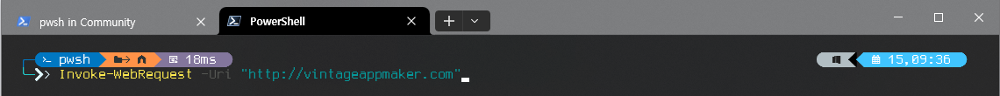
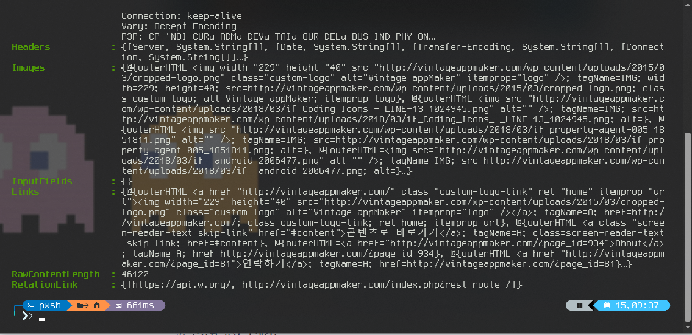
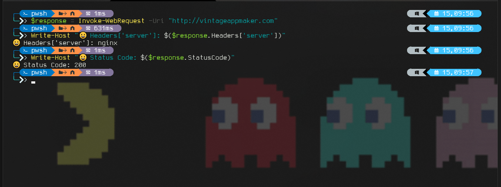

# Invoke Web Request
Invoke Web Request는 curl과 같은 용도로 사용되지만 기능적으로 보다 강력한 내용들을 제공하고 있다. Powershell에서는 Alias로 iwr로 지정되어 있다. 그러므로 Invoke-WebRequest를 모두 입력하기 보다는 iwr로 단순입력하며 사용하기를 권장한다.  

1. **기본 사용법**:


```powershell
# 기본사용법  -Uri에 주소를 입력한다. 
Invoke-WebRequest -Uri "http://vintageappmaker.com"
```
    
2. **Section값 가져오기**:



iwr을 실행 후, 리턴된 결과값에는 구조화된 정보로 내용을 관리하게 된다. 그러므로 리턴된 결과값에서 특정 정보를 . 연산자를 통해 지정하여 가져올 수 있다.    
    
```powershell
$response = Invoke-WebRequest -Uri "http://vintageappmaker.com"
Write-Host "😀 Headers['server']: $($response.Headers['server'])"
Write-Host "😀 Status Code: $($response.StatusCode)"
```
    
3. **POST 요청 보내기**:
    
```powershell
$uri = "인터넷주소"
$body = @{
    key1 = "value1"
    key2 = "value2"
}
$response = Invoke-WebRequest -Uri $uri -Method Post -Body $body
```
    
4. **인증된 요청 보내기**:
    
```powershell
$uri = "인터넷주소"
$username = "username"
$password = "password"
$response = Invoke-WebRequest -Uri $uri -Credential (Get-Credential) -UseBasicParsing
```
    
6. **JSON 데이터 파싱**:
    
```powershell
$uri = "http://headers.jsontest.com"
$response = Invoke-WebRequest -Uri $uri -UseBasicParsing
$data = $response.Content | ConvertFrom-Json
Write-Host $data
```
   
7. **파일 다운로드**:
    
```powershell
$uri = "https://github.com/VintageAppMaker/FlutterTutorial/archive/refs/heads/master.zip"
$outputFile = "$pwd\file.zip"
Invoke-WebRequest -Uri $uri -OutFile $outputFile
```
    
8. **다운로드 진행상황 표시**:
    
```powershell
$uri = "https://github.com/VintageAppMaker/FlutterTutorial/archive/refs/heads/master.zip"
$outputFile = "$pwd\largefile.zip"
Invoke-WebRequest -Uri $uri -OutFile $outputFile -Verbose
```
    
9. **Timeout 설정**:
    
```powershell
$uri = "http://www.example.com"
$timeout = 30  # 30초로 설정
$response = Invoke-WebRequest -Uri $uri -TimeoutSec $timeout
```

10. **Fileupload**:

```powershell
# 업로드할 파일 경로
$fileToUpload = "업로드파일경로"

# 업로드할 URL
$uploadUrl = "업로드할 주소"

# 파일을 업로드하는 요청 보내기
$response = Invoke-WebRequest -Uri $uploadUrl -Method Post -InFile $fileToUpload

# 응답 확인
if ($response.StatusCode -eq 200) {
    Write-Output "파일이 성공적으로 업로드되었습니다."
} else {
    Write-Output "파일 업로드에 실패했습니다. 응답 코드: $($response.StatusCode)"
}
```

11. **Cookie 추가**:

```powershell
# 쿠키 값 설정
$cookieName = "Id"
$cookieValue = "1234"

# 요청할 URL
$url = "요청할 주소"

# 쿠키를 포함한 요청 보내기
$response = Invoke-WebRequest -Uri $url -Method Get -SessionVariable session

# 세션에 쿠키 추가하기
$cookie = New-Object System.Net.Cookie
$cookie.Name = $cookieName
$cookie.Value = $cookieValue
$cookie.Domain = $url.Replace("http://","").Split("/")[0]
$session.Cookies.Add($cookie)

# 쿠키를 포함한 요청 다시 보내기
$response = Invoke-WebRequest -Uri $url -Method Get -WebSession $session

# 응답 확인
$response.Content
```


